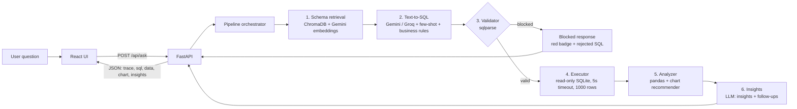
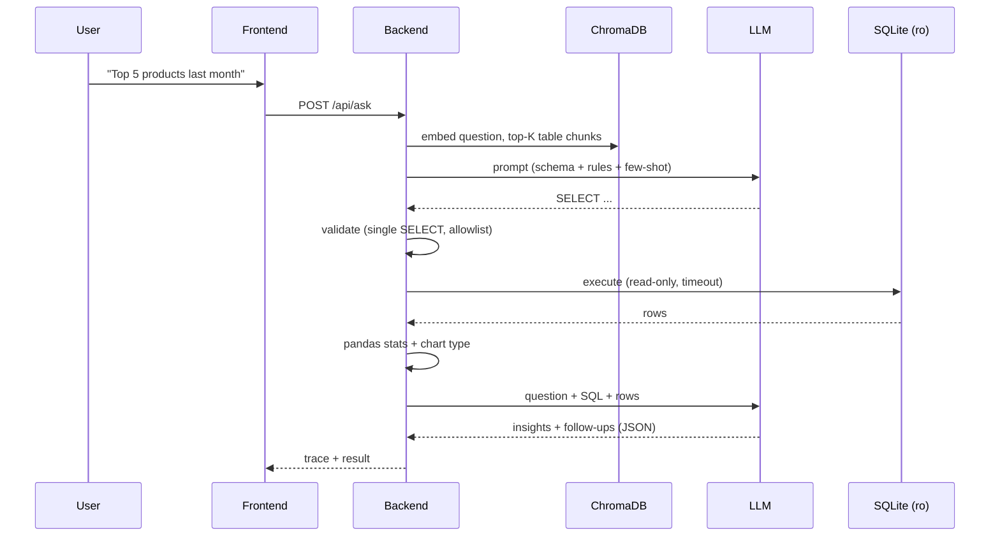

# InsightAI - Architecture

```mermaid
flowchart LR
    U[User question] --> UI[React UI]
    UI -->|POST /api/ask| API[FastAPI]
    API --> P[Pipeline orchestrator]
    P --> R[1. Schema retrieval<br/>ChromaDB + Gemini embeddings]
    R --> G[2. Text-to-SQL<br/>Gemini / Groq + few-shot + business rules]
    G --> V{3. Validator<br/>sqlparse}
    V -- blocked --> B[Blocked response<br/>red badge + rejected SQL]
    V -- valid --> E[4. Executor<br/>read-only SQLite, 5s timeout, 1000 rows]
    E --> A[5. Analyzer<br/>pandas + chart recommender]
    A --> I[6. Insights<br/>LLM: insights + follow-ups]
    I --> API
    B --> API
    API -->|JSON: trace, sql, data, chart, insights| UI
```

## Sequence

```mermaid
sequenceDiagram
    participant U as User
    participant F as Frontend
    participant B as Backend
    participant C as ChromaDB
    participant L as LLM
    participant D as SQLite (ro)
    U->>F: "Top 5 products last month"
    F->>B: POST /api/ask
    B->>C: embed question, top-K table chunks
    B->>L: prompt (schema + rules + few-shot)
    L-->>B: SELECT ...
    B->>B: validate (single SELECT, allowlist)
    B->>D: execute (read-only, timeout)
    D-->>B: rows
    B->>B: pandas stats + chart type
    B->>L: question + SQL + rows
    L-->>B: insights + follow-ups (JSON)
    B-->>F: trace + result
```

## Fallback chain

Gemini (primary model) -> Gemini (fallback model) -> Groq -> canned SQL for the five headline demo questions -> friendly error card.
